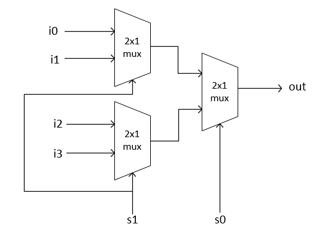
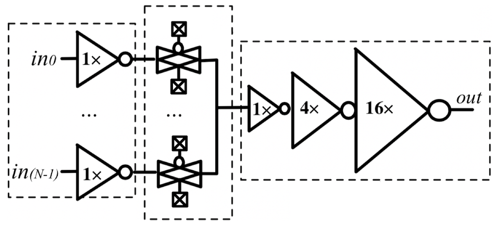

=========================================================
Skywater Custom Multiplexer Cells
=========================================================

Background
=========================================================

Traditionally, larger multiplexers are built through levels of smaller multiplexers as illustrated below:

These multiplexers lead to large power and timing constraints that limit FPGA performance. FPGA fabrics use complementary pass gate logic (CPL) to replace multiplexer trees with single level inverted transmission gate derived multiplexers, as illustrated below:

Single level multiplexers are controlled through configuration SRAM cells which enable high impedance connections throughout the multiplexer hierarchy, thereby removing the need for hierarchical designs of multiplexers.  Therefore, the CPL multiplexers enable increased performance and reduced power consumption through FPGA fabrics. Standard cells required for CPL multiplexers are not commonly included in PDKs, thereby requiring the need for custom cell creation to enable FPGA multiplexer hierarchies. The remainder of this document is dedicate to the architecture and performance of our *sky130_uuopenfpga_cc_hd_invmux2_1*/*sky130_uuopenfpga_cc_hd_invmux3_1* cells followed by a 4-to-1 multiplexer and 6-to-1 multiplexer made from our cells and standard multiplexer cells provided within the Skywater 130nm PDK.

.. INVMUX2_1

SKY130_UUOPENFPGA_CC_HD_INVMUX2_1
=========================================================

- Usage: 2-Input Transmission Gate Multiplexer with Unity Drive Strength Inverter Input
    -Pins: 
        - Q1/Q2 - Inverter Input
        - S0/S1 - NMOS Select Input
        - S0B/S1B - PMOS Select Input

- Schematic:

.. image:: figures/sky130_fd_sc_hd_mux2_1\ schematic.png
    :height: 400px
    :width: 500px
    :align: center
    :alt: Sky130_uuopenfpga_cc_hd_invmux2_1 Schematic

- Layout:\

.. image:: figures/sky130_fd_sc_hd_mux2_1\ gds.png
    :height: 450px
    :width: 800px
    :align: center
    :alt: Sky130_uuopenfpga_cc_hd_invmux2_1 Layout

- Comparison: To provide contrast on the use case of the *sky130_uuopenfpga_cc_hd_invmux2_1* cell we built a 4-to-1 multiplexer tree using the *sky130_fd_sc_hd__mux2_1* as the root cell of the multiplexer tree. The *sky130_uuopenfpga_cc_hd_invmux2_1* is used to build a single level 4-to-1 multiplexer with an inverted output.

The *sky130_fd_sc_hd_mux2_1* multiplexer is built using a static CMOS structure with a single select input, whereas our cell uses a fractured select hierarchy. To perform the comparisons we have tabulated values in regards to power, area, and timing for the 4-to-1 multiplexer tree using Synopsys PrimeTime.

- Power:
      - sky130_uuopenfpga_cc_hd_invmux2_1:  2.37 μW
      - sky130_fd_sc_hd__mux2_1:            3.03 μW

Our custom multiplexer provides a 22\% reduction in power consumption.

- Area:
    - sky130_uuopenfpga_cc_hd_invmux2_1:    33.78 μA\ :sup:`2`
    - sky130_fd_sc_hd__mux2_1:              33.78 μA\ :sup:`2`
  
Our multiplexer implementation requires equal area neglecting interconnect overhead.

- Timing:
    - sky130_uuopenfpga_cc_hd_invmux2_1:    211.1 ps
    - sky130_fd_sc_hd__mux2_1:              304.3 ps

Our custom multiplexer provides over a 31\% reduction in propagation delay.

.. _SKY130_UUOPENFPGA_CC_HD_INVMUX2_1: https://github.com/GrantBrown1994/OpenFPGA/tree/master/docs/source/custom_cells/cell_eval/SKY130_UUOPENFPGA_CC_HD_INVMUX2_1.pdf

.. INVMUX2_1

.. INVMUX3_1

SKY130_UUOPENFPGA_CC_HD_INVMUX3_1
=========================================================

- Usage: 3-Input Transmission Gate Multiplexer with Unity Drive Strength Inverter Input
    - Pins:
        - Q2/Q3 - Inverted Input
        - S0/S1/S2 - NMOS Select Input
        - S0B/S1B/S2B - PMOS Select Input

- Schematic:

.. image:: figures/sky130_fd_sc_hd_mux3_1\ schematic.png
    :height: 600px
    :width: 600px
    :align: center
    :alt: Sky130_uuopenfpga_cc_hd_invmux3_1 Schematic

- Layout:

.. image:: figures/sky130_fd_sc_hd_mux3_1\ gds.png
    :height: 400px
    :width: 1100px
    :align: center
    :alt: Sky130_uuopenfpga_cc_hd_invmux3_1 Layout

- Comparison: To provide contrast on the use case of the *sky130_uuopenfpga_cc_hd_invmux3_1* cell, we built a 6-to-1 multiplexer tree using the *sky130_fd_sc_hd__mux4_1* and *sky130_fd_sc_hd__mux2_1* as the root cells of the multiplexer tree. The *sky130_uuopenfpga_cc_hd_invmux3_1* is used to build a single level 6-to-1 multiplexer with an inverted output.

The *sky130_fd_sc_hd__mux4/2_1* cell are built using a static CMOS structure with a single select input, whereas our cell uses a fractured select hierarchy. To perform the comparisons we have tabulated values in regards to power, area, and timing for the 4-to-1 multiplexer tree using Synopsys PrimeTime and Cadence ADE XL.

- Power:
      - sky130_uuopenfpga_cc_hd_invmux3_1:  2.96 μW
      - sky130_fd_sc_hd__mux2_1:            3.31 μW
  
Our custom multiplexer provides a 10.5\% reduction in power consumption.

- Area:
    - sky130_uuopenfpga_cc_hd_invmux3_1:    61.31 μA\ :sup:`2`
    - sky130_fd_sc_hd__mux2_1:              48.80 μA\ :sup:`2`

The Skywater multiplexer provides a 20\% reduction in area.

- Timing:
    - sky130_uuopenfpga_cc_hd_invmux3_1:    272.6 ps
    - sky130_fd_sc_hd__mux2_1:              374.2 ps

Our custom multiplexer provides over a 27\% reduction in propagation delay.

.. _SKY130_UUOPENFPGA_CC_HD_INVMUX3_1: https://github.com/GrantBrown1994/OpenFPGA/tree/master/docs/source/custom_cells/cell_eval/SKY130_UUOPENFPGA_CC_HD_INVMUX3_1.pdf

.. INVMUX3_1